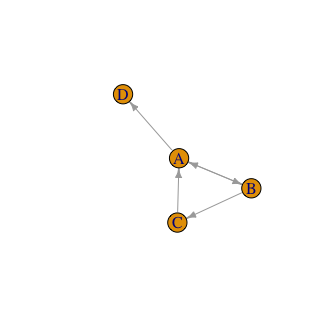
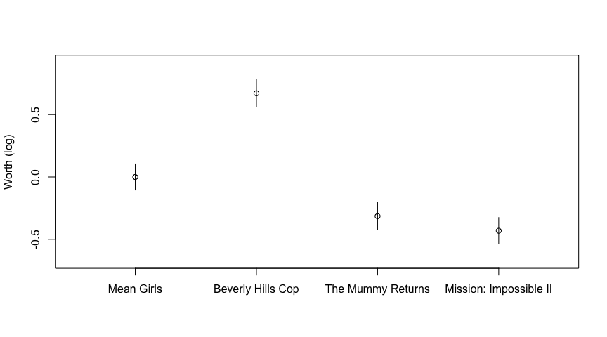

# PlackettLuce

[](https://cran.r-project.org/package=PlackettLuce)
[](https://github.com/hturner/PlackettLuce/actions/workflows/R-CMD-check.yaml)
[](https://app.codecov.io/gh/hturner/PlackettLuce?branch=main)

Package website: <https://hturner.github.io/PlackettLuce/>.

## Overview

The **PlackettLuce** package implements a generalization of the model
jointly attributed to Plackett (1975) and Luce (1959) for modelling
rankings data. Examples of rankings data might be the finishing order of
competitors in a race, or the preference of consumers over a set of
competing products.

The output of the model is an estimated **worth** for each item that
appears in the rankings. The parameters are generally presented on the
log scale for inference.

The implementation of the Plackett-Luce model in **PlackettLuce**:

- Accommodates ties (of any order) in the rankings, e.g. bananas $\succ$
  {apples, oranges} $\succ$ pears.
- Accommodates sub-rankings, e.g. pears $\succ$ apples, when the full
  set of items is {apples, bananas, oranges, pears}.
- Handles disconnected or weakly connected networks implied by the
  rankings, e.g. where one item always loses as in figure below. This is
  achieved by adding pseudo-rankings with a hypothetical or ghost item.

<!-- --> </br>

In addition the package provides methods for

- Obtaining quasi-standard errors, that don’t depend on the constraints
  applied to the worth parameters for identifiability.
- Fitting Plackett-Luce trees, i.e. a tree that partitions the rankings
  by covariate values, such as consumer attributes or racing conditions,
  identifying subgroups with different sets of worth parameters for the
  items.

## Installation

The package may be installed from CRAN via

``` r
install.packages("PlackettLuce")
```

The development version can be installed via

``` r
# install.packages("devtools")
devtools::install_github("hturner/PlackettLuce")
```

## Usage

The [Netflix Prize](https://en.wikipedia.org/wiki/Netflix_Prize) was a
competition devised by Netflix to improve the accuracy of its
recommendation system. To facilitate this they released ratings about
movies from the users of the system that have been transformed to
preference data and are available from
[PrefLib](https://www.preflib.org/dataset/00004), (Bennett and Lanning
2007). Each data set comprises rankings of a set of 3 or 4 movies
selected at random. Here we consider rankings for just one set of movies
to illustrate the functionality of **PlackettLuce**.

The data can be read in using the `read.soc` function in
**PlackettLuce**

``` r
library(PlackettLuce)
preflib <- "https://raw.githubusercontent.com/PrefLib/PrefLib-Data/main/datasets"
netflix <- read.soc(file.path(preflib, "00004%20-%20netflix/00004-00000138.soc"))
head(netflix, 2)
```

    ##   Freq Rank 1 Rank 2 Rank 3 Rank 4
    ## 1   68      2      1      4      3
    ## 2   53      1      2      4      3

Each row corresponds to a unique ordering of the four movies in this
data set. The number of Netflix users that assigned that ordering is
given in the first column, followed by the four movies in preference
order. So for example, 68 users ranked movie 2 first, followed by movie
1, then movie 4 and finally movie 3.

`PlackettLuce`, the model-fitting function in **PlackettLuce** requires
that the data are provided in the form of *rankings* rather than
*orderings*, i.e.  the rankings are expressed by giving the rank for
each item, rather than ordering the items. We can create a `"rankings"`
object from a set of orderings as follows

``` r
R <- as.rankings(netflix[,-1], input = "orderings",
                 items = attr(netflix, "items"))
R[1:3, as.rankings = FALSE]
```

    ##   Mean Girls Beverly Hills Cop The Mummy Returns Mission: Impossible II
    ## 1          2                 1                 4                      3
    ## 2          1                 2                 4                      3
    ## 3          2                 1                 3                      4

Note that `read.soc` saved the names of the movies in the `"items"`
attribute of `netflix`, so we have used these to label the items.
Subsetting the rankings object `R` with `as.rankings = FALSE`, returns
the underlying matrix of rankings corresponding to the subset. So for
example, in the first ranking the second movie (Beverly Hills Cop) is
ranked number 1, followed by the first movie (Mean Girls) with rank 2,
followed by the fourth movie (Mission: Impossible II) and finally the
third movie (The Mummy Returns), giving the same ordering as in the
original data.

Various methods are provided for `"rankings"` objects, in particular if
we subset the rankings without `as.rankings = FALSE`, the result is
again a `"rankings"` object and the corresponding print method is used:

``` r
R[1:3]
```

    ##                                          1 
    ## "Beverly Hills Cop > Mean Girls > Mis ..." 
    ##                                          2 
    ## "Mean Girls > Beverly Hills Cop > Mis ..." 
    ##                                          3 
    ## "Beverly Hills Cop > Mean Girls > The ..."

``` r
print(R[1:3], width = 60)
```

    ##                                                              1 
    ## "Beverly Hills Cop > Mean Girls > Mission: Impossible II  ..." 
    ##                                                              2 
    ## "Mean Girls > Beverly Hills Cop > Mission: Impossible II  ..." 
    ##                                                              3 
    ## "Beverly Hills Cop > Mean Girls > The Mummy Returns > Mis ..."

The rankings can now be passed to `PlackettLuce` to fit the
Plackett-Luce model. The counts of each ranking provided in the
downloaded data are used as weights when fitting the model.

``` r
mod <- PlackettLuce(R, weights = netflix$Freq)
coef(mod, log = FALSE)
```

    ##             Mean Girls      Beverly Hills Cop      The Mummy Returns 
    ##              0.2306285              0.4510655              0.1684719 
    ## Mission: Impossible II 
    ##              0.1498342

Calling `coef` with `log = FALSE` gives the worth parameters,
constrained to sum to one. These parameters represent the probability
that each movie is ranked first.

For inference these parameters are converted to the log scale, by
default setting the first parameter to zero so that the standard errors
are estimable:

``` r
summary(mod)
```

    ## Call: PlackettLuce(rankings = R, weights = netflix$Freq)
    ## 
    ## Coefficients:
    ##                        Estimate Std. Error z value Pr(>|z|)    
    ## Mean Girls              0.00000         NA      NA       NA    
    ## Beverly Hills Cop       0.67080    0.07472   8.978  < 2e-16 ***
    ## The Mummy Returns      -0.31404    0.07593  -4.136 3.53e-05 ***
    ## Mission: Impossible II -0.43128    0.07489  -5.759 8.47e-09 ***
    ## ---
    ## Signif. codes:  0 '***' 0.001 '**' 0.01 '*' 0.05 '.' 0.1 ' ' 1
    ## 
    ## Residual deviance:  3493.5 on 3525 degrees of freedom
    ## AIC:  3499.5 
    ## Number of iterations: 6

In this way, Mean Girls is treated as the reference movie, the positive
parameter for Beverly Hills Cop shows this was more popular among the
users, while the negative parameters for the other two movies show these
were less popular.

Comparisons between different pairs of movies can be made visually by
plotting the log-worth parameters with comparison intervals based on
quasi standard errors.

``` r
qv <- qvcalc(mod)
plot(qv, ylab = "Worth (log)", main = NULL)
```

<!-- -->

If the intervals overlap there is no significant difference. So we can
see that Beverly Hills Cop is significantly more popular than the other
three movies, Mean Girls is significant more popular than The Mummy
Returns or Mission: Impossible II, but there was no significant
difference in users’ preference for these last two movies.

## Going Further

The core functionality of **PlackettLuce** is illustrated in the package
vignette, along with details of the model used in the package and a
comparison to other packages. The vignette can be found on the [package
website](https://hturner.github.io/PlackettLuce/) or from within R once
the package has been installed, e.g. via

    vignette("Overview", package = "PlackettLuce")

## Code of Conduct

Please note that this project is released with a [Contributor Code of
Conduct](https://github.com/hturner/PlackettLuce/blob/master/CONDUCT.md).
By participating in this project you agree to abide by its terms.

## References

<div id="refs" class="references csl-bib-body hanging-indent"
entry-spacing="0">

<div id="ref-Bennett2007" class="csl-entry">

Bennett, J., and S. Lanning. 2007. “The Netflix Prize.” In
*<span class="nocase">Proceedings of the KDD Cup Workshop 2007</span>*,
3–6. ACM.

</div>

<div id="ref-Luce1959" class="csl-entry">

Luce, R. Duncan. 1959. *Individual Choice Behavior: A Theoretical
Analysis*. New York: Wiley.

</div>

<div id="ref-Plackett1975" class="csl-entry">

Plackett, Robert L. 1975. “<span class="nocase">The Analysis of
Permutations</span>.” *Appl. Statist* 24 (2): 193–202.
<https://doi.org/10.2307/2346567>.

</div>

</div>
