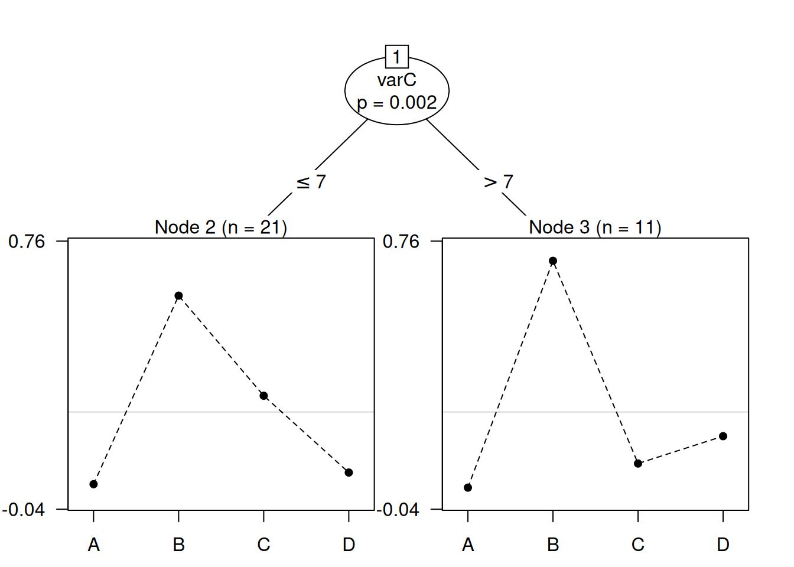

# Plackett-Luce Models with Item Covariates

## 1 Introduction

The main model-fitting function in the **PlackettLuce** package,
`PlackettLuce`, directly models the worth of items with a separate
parameter estimate for each item (see [Introduction to
PlackettLuce](https://hturner.github.io/PlackettLuce/articles/Overview.md)).
This vignette introduces a new function, `pladmm`, that models the
log-worth of items by a linear function of item covariates. This
functionality is under development and provided for experimental use -
the user interface is likely to change in upcoming versions of
PlackettLuce.

`pladmm` supports partial rankings, but otherwise has limited
functionality compared to `PlackettLuce`. In particular, ties,
pseudo-rankings, prior information on log-worths, and ranker adherence
parameters are not supported.

## 2 Plackett-Luce model with item covariates

The standard Plackett-Luce model specifies the probability of a ranking
of \\J\\ items, \\{i_1 \succ \ldots \succ i_J}\\, is given by

\\\prod\_{j=1}^J \frac{\alpha\_{i_j}}{\sum\_{i \in A_j} \alpha_i}\\

where \\\alpha\_{i_j}\\ represents the **worth** of item \\i_j\\ and
\\A_j\\ is the set of alternatives \\\\i_j, i\_{j + 1}, \ldots, i_J\\\\
from which item \\i_j\\ is chosen.

`pladmm` models the log-worth as a linear function of item covariates:

\\\log \alpha_i = \beta_0 + \beta_1 x\_{i1} + \ldots + \beta_p x\_{ip}\\

where \\\beta_0\\ is fixed by the constraint that \\\sum_i \alpha_i =
1\\. The parameters are estimated using an Alternating Directions Method
of Multipliers (ADMM) algorithm proposed by ([Yildiz et al.
2020](#ref-Yildiz2020)), hence the name `pladmm`.

ADMM alternates between estimating the worths \\\alpha_i\\ and the
linear coefficients \\\beta_k\\, encapsulating them in a quadratic
penalty on the likelihood:

\\L(\boldsymbol{\beta}, \boldsymbol{\alpha}, \boldsymbol{u}) =
\mathcal{L}(\mathcal{D}\|\boldsymbol{\alpha}) +
\frac{\rho}{2}\|\|\boldsymbol{X}\boldsymbol{\beta} - \log
\boldsymbol{\alpha} + \boldsymbol{u}\|\|^2_2 -
\frac{\rho}{2}\|\|\boldsymbol{u}\|\|^2_2\\ where \\\boldsymbol{u}\\ is a
dual variable that imposes the equality constraints (so that \\\log
\boldsymbol{\alpha}\\ converges to
\\\boldsymbol{X}\boldsymbol{\beta}\\).

## 3 Salad Data

We shall illustrate the use of `pladmm` with a classic data set
presented by ([Critchlow and Fligner 1991](#ref-Critchlow1991)) that is
provided as the `salad` data set in **PlackettLuce**. The data are 32
full rankings of 4 salad dressings (A, B, C, D) by tartness, with 1
being the most tart and 4 being the least tart, according to the ranker.

``` r
library(PlackettLuce)
head(salad, 4)
```

    ##   A B C D
    ## 1 1 2 3 4
    ## 2 1 2 3 4
    ## 3 2 1 3 4
    ## 4 2 1 4 3

The salad dressings were made with known quantities of acetic acid and
gluconic acid, as specified in the following data frame:

``` r
features <- data.frame(salad = LETTERS[1:4],
                       acetic = c(0.5, 0.5, 1, 0),
                       gluconic = c(0, 10, 0, 10))
```

### 3.1 Standard Plackett-Luce model

We begin by using `pladmm` to fit a standard Plackett-Luce model, with a
separate parameter for each salad dressing. The first three arguments
are the rankings (a matrix or `rankings` object), a formula specifying
the model for the log-worth (must include an intercept) and a data frame
of item features containing variables in the model formula. `rho` is the
penalty parameter determining the strength of penalty on the
log-likelihood. As a rule of thumb, `rho` should be ~10% of the fitted
log-likelihood.

``` r
standardPL <- pladmm(salad, ~ salad, data = features, rho = 8)
summary(standardPL)
```

    ## Call: pladmm(rankings = salad, formula = ~salad, data = features, rho = 8)
    ## 
    ## Coefficients:
    ##             Estimate Std. Error z value Pr(>|z|)    
    ## (Intercept)  -3.1740         NA      NA       NA    
    ## saladB        2.7305     0.4481   6.093 1.11e-09 ***
    ## saladC        1.5621     0.3965   3.939 8.17e-05 ***
    ## saladD        1.0275     0.3771   2.725  0.00644 ** 
    ## ---
    ## Signif. codes:  0 '***' 0.001 '**' 0.01 '*' 0.05 '.' 0.1 ' ' 1
    ## 
    ## Residual deviance:  152.83 on 189 degrees of freedom
    ## AIC:  158.83 
    ## Number of iterations: 7

In this case, the intercept represents the log-worth of salad dressing
A, which is fixed by the constraint that the worths sum to 1.

``` r
sum(exp(standardPL$x %*% coef(standardPL)))
```

    ## [1] 1

The remaining coefficients are the difference in log-worth between each
salad dressing and salad dressing A. We can compare this to the results
from `PlackettLuce`, which sets the log-worth of salad dressing A to
zero:

``` r
standardPL_PlackettLuce <- PlackettLuce(salad, npseudo = 0)
summary(standardPL_PlackettLuce)
```

    ## Call: PlackettLuce(rankings = salad, npseudo = 0)
    ## 
    ## Coefficients:
    ##   Estimate Std. Error z value Pr(>|z|)    
    ## A   0.0000         NA      NA       NA    
    ## B   2.7299     0.4481   6.093 1.11e-09 ***
    ## C   1.5615     0.3965   3.939 8.20e-05 ***
    ## D   1.0268     0.3771   2.723  0.00646 ** 
    ## ---
    ## Signif. codes:  0 '***' 0.001 '**' 0.01 '*' 0.05 '.' 0.1 ' ' 1
    ## 
    ## Residual deviance:  152.83 on 189 degrees of freedom
    ## AIC:  158.83 
    ## Number of iterations: 6

The differences in log-worth are the same to ~3 decimal places. We can
improve the accuracy of `pladmm` by reducing `rtol` (by default 1e-4):

``` r
standardPL <- pladmm(salad, ~ salad, data = features, rho = 8, rtol = 1e-6)
summary(standardPL)
```

    ## Call: pladmm(rankings = salad, formula = ~salad, data = features, rho = 8, 
    ##     rtol = 1e-06)
    ## 
    ## Coefficients:
    ##             Estimate Std. Error z value Pr(>|z|)    
    ## (Intercept)  -3.1735         NA      NA       NA    
    ## saladB        2.7299     0.4481   6.093 1.11e-09 ***
    ## saladC        1.5615     0.3965   3.939 8.20e-05 ***
    ## saladD        1.0268     0.3771   2.723  0.00646 ** 
    ## ---
    ## Signif. codes:  0 '***' 0.001 '**' 0.01 '*' 0.05 '.' 0.1 ' ' 1
    ## 
    ## Residual deviance:  152.83 on 189 degrees of freedom
    ## AIC:  158.83 
    ## Number of iterations: 17

The `itempar` function can be used to obtain the worth estimates, e.g. 

``` r
itempar(standardPL)
```

    ## Item response item parameters (PLADMM):
    ##       A       B       C       D 
    ## 0.04186 0.64176 0.19950 0.11688

### 3.2 Plackett-Luce model with item covariates

To model the log-worth by item covariates, we simply update the model
formula:

``` r
regressionPL <- pladmm(salad, ~ acetic + gluconic, data = features, rho = 8)
summary(regressionPL)
```

    ## Call: pladmm(rankings = salad, formula = ~acetic + gluconic, data = features, 
    ##     rho = 8)
    ## 
    ## Coefficients:
    ##             Estimate Std. Error z value Pr(>|z|)    
    ## (Intercept) -4.84097         NA      NA       NA    
    ## acetic       3.27431    0.57650   5.680 1.35e-08 ***
    ## gluconic     0.27392    0.04505   6.081 1.20e-09 ***
    ## ---
    ## Signif. codes:  0 '***' 0.001 '**' 0.01 '*' 0.05 '.' 0.1 ' ' 1
    ## 
    ## Residual deviance:  152.9 on 190 degrees of freedom
    ## AIC:  156.9 
    ## Number of iterations: 14

The model uses one less degree of freedom, but there is only a slight
increase in the deviance, that is not significant:

``` r
anova(standardPL, regressionPL)
```

    ## Analysis of Deviance Table
    ## 
    ## Model 1: ~salad
    ## Model 2: ~acetic + gluconic
    ##   Resid. Df Resid. Dev Df Deviance Pr(>Chi)
    ## 1       189     152.83                     
    ## 2       190     152.91  1 0.074411    0.785

So it is sufficient to model the log-worth by the concentration of
acetic and gluconic acids.

An advantage of modelling log-worth by covariates is that we can predict
the log-worth for new items. For example, suppose we have salad
dressings with the following features:

``` r
features2 <- data.frame(salad = LETTERS[5:6],
                        acetic = c(0.5, 0),
                        gluconic = c(5, 5))
```

the predicted log-worth is given by

``` r
predict(regressionPL, features2)
```

    ##         1         2 
    ## -1.834198 -3.471352

Note that the names in `features2$salad` are unused as `salad` was not a
variable in the model. The predicted log-worths have the same location
as the original fitted values

``` r
fitted(regressionPL)
```

    ##          A          B          C          D 
    ## -3.2038115 -0.4645852 -1.5666574 -2.1017393

i.e. they are contrasts with the log-worth of salad dressing A. If we
want to express the predictions as a new set of constrained item
parameters, we can specify `type = "itempar"` (vs the default
`type = "lp"` for linear predictor). The parameterization can then be
specified by passing arguments on to
[`itempar()`](https://rdrr.io/pkg/psychotools/man/itempar.html),
e.g. the following will compute the predicted worths constrained to sum
to 1:

``` r
predict(regressionPL, features2, type = "itempar", log  = FALSE, ref = NULL)
```

    ##         1         2 
    ## 0.8371473 0.1628527

Standard errors can optionally be returned, by specifying
`se.fit = TRUE`

``` r
predict(regressionPL, features2, type = "itempar", log  = FALSE, ref = NULL,
        se.fit = TRUE)
```

    ## $fit
    ##         1         2 
    ## 0.8371473 0.1628527 
    ## 
    ## $se.fit
    ##          1          2 
    ## 0.03929727 0.03929727

### 3.3 Plackett-Luce tree with item covariates

The Plackett-Luce model with item covariates can also be used in
model-based partitioning. To illustrate, we shall simulate some
covariate data for the judges that ranked the four salads, based on
their ranking of salad C

``` r
set.seed(1)
judge_features <- data.frame(varC = rpois(nrow(salad), lambda = salad$C^2))
```

This simulates the scenario where some characteristic of the judge
affects how they rank salad C, so we expect the item worth to depend on
this variable.

Now we group the rankings by judge in preparation to fit a Plackett-Luce
tree:

``` r
grouped_salad <- group(as.rankings(salad), 1:nrow(salad))
```

We specify the Plackett-Luce tree to partition the grouped rankings by
any of the judge features (`grouped_salad ~ .`), with the log-worth of
the salads modelled by a linear function of the acetic and gluconic acid
concentrations (`~acetic + gluconic`). The corresponding variables are
found in `data`, which should be a list of two data frames, the first
containing the group covariates and the second containing the item
covariates. We set a minimum group size of 10 and reduce the `rho`
parameter accordingly.

``` r
tree <- pltree(grouped_salad ~ .,
               worth = ~acetic + gluconic,
               data = list(judge_features, features),
               rho = 2, minsize = 10)
plot(tree, ylines = 2)
```



The result is a tree with two nodes; both groups prefer salad B, but the
first group (varC ≤ 7) places salad C in second place, while the second
group (varC \> 7) prefer salad D. This is as we might expect, since we
simulated the judge covariate varC to correlate with the ranking of C,
so a higher value of this variable correlates to a lower preference for
C. We can see the difference in the coefficients of the item features:

``` r
tree
```

    ## Plackett-Luce tree
    ## 
    ## Model formula:
    ## grouped_salad ~ .
    ## 
    ## Fitted party:
    ## [1] root
    ## |   [2] varC <= 7: n = 21
    ## |       (Intercept)      acetic    gluconic 
    ## |        -5.5121162   4.3035356   0.2845096 
    ## |   [3] varC > 7: n = 11
    ## |       (Intercept)      acetic    gluconic 
    ## |        -5.0821780   2.7423782   0.3355964 
    ## 
    ## Number of inner nodes:    1
    ## Number of terminal nodes: 2
    ## Number of parameters per node: 3
    ## Objective function (negative log-likelihood): 71.40774

From the first group to the second group, the coefficient for acetic
acid concentration reduces from 4.3 to 2.7. Since the acetic acid
concentration for salad C is 1, with 0 gluconic acid, this reduces the
worth of salad C in the second group. At the same time, the coefficient
for gluconic acid concentration increases 0.28 to 0.34 between the first
and second groups. Since the gluconic acid concentration for salad D is
1, with 0 acetic acid, this increases the worth of salad D in the second
group.

## 4 Cautionary notes

The PLADMM algorithm should in theory converge to the maximum likelihood
estimates for the parameters. However, the algorithm may not behave well
if the rankings are very sparse or if the penalty parameter `rho` is not
set to a suitable value. Currently, `pladmm` does not provide
checks/warnings to assist the user the validate the result. It is
recommended that the standard Plackett-Luce model is fitted initially to
give a reference of the expected log-likelihood and item parameters -
`pladmm` should give broadly similar results.

`pladmm` also returns two estimates of the worths. The first set are the
direct estimates from the last iteration of ADMM:

``` r
regressionPL$pi
```

    ##          A          B          C          D 
    ## 0.04061305 0.62842986 0.20872416 0.12223294

The second set are the estimates given by the estimates of
\\\boldsymbol{\beta}\\ from the last iteration:

``` r
regressionPL$tilde_pi
```

    ##          A          B          C          D 
    ## 0.04060714 0.62839568 0.20874175 0.12224363

These two sets of estimates should be approximately the same (but being
approximately the same does not guarantee the solution is the global
optimum).

## References

Critchlow, Douglas, and Michael Fligner. 1991. “Paired comparison,
triple comparison, and ranking experiments as generalized linear models,
and their implementation on GLIM.” *Psychometrika* 56 (3): 517–33.
<https://doi.org/10.1007/BF02294488>.

Yildiz, Ilkay, Jennifer Dy, Deniz Erdogmus, Jayashree Kalpathy-Cramer,
Susan Ostmo, J. Peter Campbell, Michael F. Chiang, and Stratis
Ioannidis. 2020. “Fast and Accurate Ranking Regression.” In *Proceedings
of the Twenty Third International Conference on Artificial Intelligence
and Statistics*, edited by Silvia Chiappa and Roberto Calandra,
108:77–88. Proceedings of Machine Learning Research.
[http://proceedings.mlr.press/v108/yildiz20a.html](http://proceedings.mlr.press/v108/yildiz20a.md).
