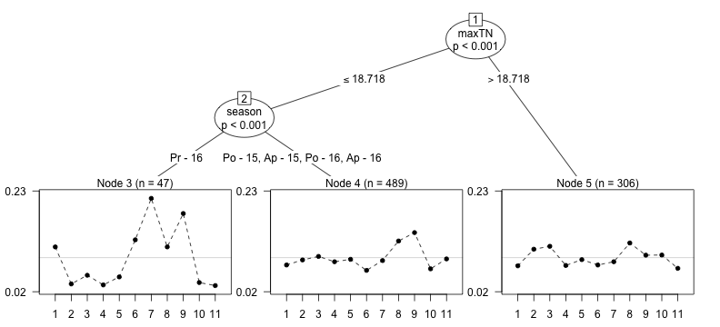

```{r setup, include = FALSE}
library(knitr)
knitr::knit_hooks$set(crop = function(before, options, envir) {
    # disable cropping even if magick package installed
    if (!before) return()
})
eval_all <- FALSE # evaluate all timings and pltree?
extra <- requireNamespace("kableExtra")
# if render using rmarkdown, use output format to decide table format
table.format <- opts_knit$get("rmarkdown.pandoc.to")
if (!identical(table.format, "latex")) table.format <- "html"
opts_knit$set(knitr.table.format = table.format)
opts_chunk$set(message = FALSE)
```

# Introduction

Rankings data, in which each observation is an ordering of a set of items,
arises in a range of applications, for example sports tournaments and consumer
studies. A classic model for such data is the Plackett-Luce model. This model
depends on Luce's axiom of choice [@Luce1959; @Luce1977] which states that the odds of
choosing an item over another do not depend on the set of items from which the
choice is made. Suppose we have a set of $J$ items

$$S = \{i_1, i_2, \ldots, i_J\}.$$

Then under Luce's axiom, the probability of selecting some item $j$
from $S$ is given by

$$P(j | S) = \frac{\alpha_{j}}{\sum_{i \in S} \alpha_i}$$

where $\alpha_i$ represents the **worth** of item $i$. Viewing a ranking of $J$
items as a sequence of choices --- first choosing the top-ranked item from all
items, then choosing the second-ranked item from the remaining items and so
on --- it follows that the probability of the ranking
${i_1 \succ \ldots \succ i_J}$ is

$$\prod_{j=1}^J \frac{\alpha_{i_j}}{\sum_{i \in A_j} \alpha_i}$$

where $A_j$ is the set of alternatives $\{i_j, i_{j + 1}, \ldots, i_J\}$ from
which item $i_j$ is chosen. The above model is also derived in @Plackett1975,
hence the name Plackett-Luce model.

The **PlackettLuce** package implements a novel extension of the Plackett-Luce
model that accommodates tied rankings, which may be applied to either full or
partial rankings. Pseudo-rankings are utilised to obtain estimates in cases
where the maximum likelihood estimates do not exist, or do not have finite
standard errors. Methods are provided to obtain different parameterizations with
corresponding standard errors or quasi-standard errors (that are independent of
parameter constraints). There is also a method to work with the **psychotree**
package to fit Plackett-Luce trees.

## Comparison with other packages

Even though the Plackett-Luce model is a well-established method for analysing
rankings, the software available to fit the model is limited. By considering
each choice in the ranking as a multinomial observation, with one item observed
out of a possible set, the "Poisson trick" [see, for example, @Baker1994] can be
applied to express the model as a log-linear model, where the response is the
count (one or zero) of each possible outcome within each choice. In principle, the
model can then be fitted using standard software for generalized linear
models. However there are a number of difficulties with this. Firstly, dummy
variables must be set up to represent the presence or absence of each item in
each choice and a factor created to identify each choice, which is a
non-standard task. Secondly the factor identifying each choice will have many
levels: greater than the number of rankings, for rankings of more than two
objects. Thus there are many parameters to estimate and a standard function such
as `glm` will be slow to fit the model, or may even fail as the corresponding
model matrix will be too large to fit in memory. This issue can be circumvented
by using the `gnm` function from **gnm**, which provides an `eliminate` argument
to efficiently estimate the effects of such a factor. Even then, the
model-fitting may be relatively slow, given the expansion in the number of
observations when rankings are converted to counts. For example, the ranking {item
3 $\prec$ item 1 $\prec$ item 2} expands to two choices with five counts all
together:

```{r, echo = FALSE}
as.matrix(data.frame(choice = c(1, 1, 1, 2, 2),
                     `item 1` = c(1, 0, 0, 1, 0),
                     `item 2` = c(0, 1, 0, 0, 1),
                     `item 3` = c(0, 0, 1, 0, 0),
                     count = c(0, 0, 1, 1, 0), check.names = FALSE))

```

It is possible to aggregate observations of the same choice from the same set of
alternatives, but the number of combinations increases quickly with the number
of items.

Given the issues with applying general methods, custom algorithms and software
have been developed. One approach is using Hunter's [-@Hunter2004]
minorization-maximization (MM) algorithm to maximize the likelihood, which is
equivalent to an iterative scaling algorithm; this algorithm is used by the
**StatRank** package. Alternatively
the likelihood of the observed data under the PlackettLuce model can be
maximised directly using a generic optimisation method such the
Broyden–Fletcher–Goldfarb–Shanno (BFGS) algorithm, as is done by the **pmr**
and **hyper2** packages. Finally, Bayesian methods can be used to either
maximize the posterior distribution via an Expectation Maximization (EM)
algorithm or to simulate the posterior distribution using
Markov-chain Monte-Carlo (MCMC) techniques, both of which are provided by
**PLMIX**. **PlackettLuce** offers both iterative scaling and generic
optimization using either BFGS or a limited memory variant (L-BFGS) via the
**lbfgs** package.

Even some of these specialized implementations can scale poorly with the number
of items and/or the number of rankings as shown by the example timings in Table
\@ref(tab:timings-kable). Specifically `pmr::pl` becomes impractical to use with
a moderate number of items (~10), while the functions from **hyper2** and
**StatRank** take much longer to run with a large number (1000s) of unique
rankings. **PlackettLuce** copes well with these moderately-sized data sets,
though is not quite as fast as **PLMIX** when both the number of items and the
number of unique rankings is large.

```{r soc, eval = eval_all, echo = FALSE}
library(PlackettLuce)
# read in example data sets
# - originally from https://PrefLib.org, also distributed in PlackettLuce package
# netflix: 00004-00000138.soc
netflix <- read.soc(system.file("extdata", "netflix.soc",
                                package = "PlackettLuce"))
# tshirt: 00012-00000001.soc
tshirt <- read.soc(system.file("extdata", "shirt.soc",
                               package = "PlackettLuce"))
# sushi: 00014-00000001.soc   
sushi <- read.soc(system.file("extdata", "sushi.soc",
                              package = "PlackettLuce"))
```
```{r wrappers, eval = eval_all, echo = FALSE}
pl <- function(dat, ...){
    # convert ordered items to ranking
    R <- as.rankings(dat[,-1], "ordering")
    # fit without adding pseudo-rankings, weight rankings by count
    PlackettLuce(R, npseudo = 0, weights = dat$Freq)
}
hyper2 <- function(dat, ...){
    requireNamespace("hyper2")
    # create likelihood object based on ordered items and counts
    pnames <- paste0("p", seq_len(ncol(dat) - 1))
    H <- hyper2::hyper2(pnames = pnames)
    for (i in seq_len(nrow(dat))){
        x <-  pnames[dat[i, -1][dat[i, -1] > 0]]
        H <- H + hyper2::race(x)*dat[i, 1]
    }
    # find parameters to maximise likelihood
    p <- hyper2::maxp(H)
    structure(p, loglik = hyper2::loglik(p = p[-length(p)], H = H))
}
plmix <- function(dat, ...){
    requireNamespace("PLMIX")
    # disaggregate data (no functionality for weights or counts)
    r <- rep(seq_len(nrow(dat)), dat$Freq)
    # maximum a posteriori estimate, with non-informative prior
    # K items in each ranking, single component distribution
    # default starting values do not always work so specify as uniform
    K <- ncol(dat) - 1
    PLMIX::mapPLMIX(as.matrix(dat[r, -1]), K = K, G = 1,
                    init = list(p = rep.int(1/K, K)), plot_objective = FALSE)
}
pmr <- function(dat, ...){
    requireNamespace("pmr")
    # convert ordered items to ranking
    R <- as.rankings(dat[,-1], "ordering")
    # create data frame with counts as required by pl
    X <- as.data.frame(unclass(R))
    X$Freq <- dat$Freq
    capture.output(res <- pmr::pl(X))
    res
}
statrank <- function(dat, iter){
    requireNamespace("StatRank")
    # disaggregate data (no functionality for weights or counts)
    r <- rep(seq_len(nrow(dat)), dat$Freq)
    capture.output(res <- StatRank::Estimation.PL.MLE(as.matrix(dat[r, -1]),
                                                      iter = iter))
    res
}
```

```{r timings, eval = eval_all, echo = FALSE, message = FALSE, warning = FALSE}
timings <- function(dat, iter = NULL,
                    fun = c("pl", "hyper2", "plmix", "pmr", "statrank")){
    res <- list()
    for (nm in c("pl", "hyper2", "plmix", "pmr", "statrank")){
        if (nm %in% fun){
            res[[nm]] <- suppressWarnings(
                system.time(do.call(nm, list(dat, iter)))[["elapsed"]])
        } else res[[nm]] <- NA
    }
    res
}
netflix_timings <- timings(netflix, 6)
tshirt_timings <- timings(tshirt, 341,
                          fun = c("pl", "hyper2", "plmix", "statrank"))
sushi_timings <- timings(sushi, 5,
                         fun = c("pl", "hyper2", "plmix", "statrank"))
```

```{r save-timings, echo = FALSE}
if (eval_all){
    saveRDS(netflix_timings, "netflix_timings.rds", version = 2)
    saveRDS(tshirt_timings, "tshirt_timings.rds", version = 2)
    saveRDS(sushi_timings, "sushi_timings.rds", version = 2)
} else {
    netflix_timings <- readRDS("netflix_timings.rds")
    tshirt_timings <- readRDS("tshirt_timings.rds")
    sushi_timings <- readRDS("sushi_timings.rds")
}
```

(ref:features) Features of example data sets from PrefLib [@Mattei2013]. The Netflix data are from [@Bennett2007] and the Sushi data were introduced in [@Kamishima2004].

```{r data-features, echo = FALSE}
features <- cbind(c(1256, 30, 5000),
                  c(24, 30, 4926),
                  c(4, 11, 10))
dimnames(features) <- list(c("Netflix", "T-shirt", "Sushi"),
                           c("Rankings", "Unique rankings", "Items"))
kab <- kable(features,
             caption = "(ref:features)",
             booktabs = TRUE) 
if (extra){
    kableExtra::kable_styling(kab)
} else kab
```

(ref:timings) Timings in seconds for fitting the Plackett-Luce model to data sets summarised in Table \@ref(tab:data-features) using different packages. See Appendix [5.1](#app:timings) for details and code.

```{r timings-kable, echo = FALSE, results = "asis"}
res <- data.frame(netflix = round(unlist(netflix_timings), 3),
                  tshirt = format(unlist(tshirt_timings), 3),
                  sushi = round(unlist(sushi_timings), 3),
                  stringsAsFactors = FALSE)
res["pmr", "tshirt"] <- "a"
res["pmr", "sushi"] <- "a"
res <- t(as.matrix(res))
dimnames(res) <- list(c("Netflix", "T-shirt", "Sushi"),
                      c("PlackettLuce",
                        "hyper2", "PLMIX", "pmr", "StatRank"))

kab <- kable(res, booktabs = TRUE, align = rep("r", 6), caption = "(ref:timings)",
             escape = FALSE)
if (extra){
    kab <- kableExtra::kable_styling(kab)
    kab <- kableExtra::add_header_above(kab, c(" " = 1, "Time elapsed (s)" = 5))
    kableExtra::add_footnote(kab, "Function fails to complete.", 
                             notation = "alphabet")
} else {
    cat("**Time elapsed (s)**\n", kab, "\n^a Function fails to complete.", 
        sep = "\n")
}
```

As the number of items increases, it is typically more common to
observe partial rankings than complete rankings. Partial rankings can be of two
types: *sub-rankings*, where only a subset of items are ranked each time, and
*incomplete rankings*, where the top $n$ items are selected and the remaining
items are unranked, but implicitly ranked lower than the top $n$. 
**PlackettLuce** handles
sub-rankings only, while **PLMIX** handles incomplete rankings only and
**hyper2** can handle both types. **StatRank** seems to support partial rankings, but
the extent of this support is not clear. The timings in Table \@ref(tab:nascar) 
for fitting the Plackett-Luce model on the NASCAR data from @Hunter2004 
illustrate that **PlackettLuce** is more efficient than
**hyper2** for modelling sub-rankings of a relatively large number of items.

```{r timings-sub, eval = eval_all, echo = FALSE, message = FALSE, warning = FALSE}
data(Data.Nascar, package = "StatRank")
# add column of frequencies so the format the same as before
nascar <- cbind(n = 1, Data.Nascar)
nascar_timings <- timings(nascar, fun = c("pl", "hyper2"))
```

```{r save-timings-sub, echo = FALSE}
if (eval_all){
    saveRDS(nascar_timings, "nascar_timings.rds", version = 2)
} else {
    nascar_timings <- readRDS("nascar_timings.rds")
}
```

(ref:nascar) Timings in seconds for fitting the Plackett-Luce model to the NASCAR data from @Hunter2004 using different packages. All rankings are unique.

```{r nascar, echo = FALSE}
res <- round(unlist(nascar_timings)[c("pl", "hyper2")], 3)
res <- data.frame(Rankings = 36,
                  Items = 83,
                  `Items per ranking` = "42-43",
                  PlackettLuce = res[1],
                  hyper2 = res[2],
                  check.names = FALSE, row.names = NULL)
kab <- kable(res, booktabs = TRUE, align = rep("r", 5),
      caption = "(ref:nascar)") 
if (requireNamespace("kableExtra")){
    kab <- kableExtra::kable_styling(kab)
    kableExtra::add_header_above(kab, c("Features of NASCAR data" = 3, 
                                        "Time elapsed (s)" = 2))
} else kab
```

**PlackettLuce** is the only package out of those based on maximum likelihood
estimation with the functionality to compute standard errors for the item
parameters and thereby the facility to conduct inference about these parameters.
**PLMIX** allows for inference based on the posterior distribution. In some
cases, when the network of wins and losses is disconnected or weakly connected,
the maximum likelihood estimate does not exist, or has infinite standard
error; such issues are handled in **PlackettLuce** by utilising pseudo-rankings.
This is similar to incorporating prior information as in the Bayesian approach.

**PlackettLuce** is also the only package that can accommodate tied rankings,
through a novel extension of the Plackett-Luce model. On the other hand
**hyper2** is currently the only package that can handle rankings of
combinations of items, for example team rankings in sports. **PLMIX** offers the
facility to model heterogeneous populations of subjects that have different sets
of worth parameters via mixture models. This is similar in spirit to the
model-based partitioning offered by **PlackettLuce**, except here the
sub-populations are defined by binary splits on subject attributes. A summary of
the features of the various packages for Plackett-Luce models is given in Table \@ref(tab:package-summary).

```{r package-summary, echo = FALSE}
tab <- data.frame(Feature = c("Inference", "Disconnected networks",
                              "Ties", "Teams", "Heterogenous case"),
                  PlackettLuce = c("Frequentist", "Yes", "Yes", "No", "Trees"),
                  hyper2 = c("No", "No", "No", "Yes", "No"),
                  pmr = c("No", "No", "No", "No", "No"),
                  StatRank = c("No", "No", "No", "No", "No"),
                  PLMIX = c("Bayesian", "Yes", "No", "No", "Mixtures"))
kab <- kable(tab, booktabs = TRUE,
      caption = "Features of packages for fitting the Plackett-Luce model.")
if (requireNamespace("kableExtra")){
    kableExtra::kable_styling(kab)
} else kab
```

# Methods

## Extended Plackett-Luce model

The **PlackettLuce** package permits rankings of the form

$$R = \{C_1, C_2, \ldots, C_J\}$$

where the items in set $C_1$ are ranked higher than (better than) the items
in $C_2$, and so on. If there are multiple objects in set $C_j$ these items
are tied in the ranking. For a set $S$, let

$$f(S) = \delta_{|S|} \left(\prod_{i \in S} \alpha_i \right)^\frac{1}{|S|}$$

where $|S|$ is the cardinality of the set $S$, $\delta_n$ is a parameter
representing the prevalence of ties of order $n$ (with $\delta_1 \equiv 1$), 
and $\alpha_i$ is a parameter
representing the worth of item $i$. Then under an extension of the
Plackett-Luce model allowing ties up to order $D$, the probability of the
ranking $R$ is given by

\begin{equation}
\prod_{j = 1}^J \frac{f(C_j)}{
\sum_{k = 1}^{\min(D_j, D)} \sum_{S \in {A_j \choose k}} f(S)}
(\#eq:PL)
\end{equation}

where $D_j$ is the cardinality of $A_j$, the set of alternatives from
which $C_j$ is chosen, and $A_j \choose k$ is all the possible choices of $k$
items from $A_j$. The value of $D$ can be set to the maximum number of tied
items observed in the data, so that $\delta_n = 0$ for $n > D$.

When the worth parameters are constrained to sum to one, they represent the
probability that the corresponding item comes first in a ranking of all items,
given that first place is not tied.

The 2-way tie prevalence parameter $\delta_2$ is interpretable via the probability
that two given items *of equal worth* tie for first place, given that the
first place is not a 3-way or higher tie.  Specifically, that probability is $\delta_2/(2 + \delta_2)$.

The 3-way and higher tie-prevalence parameters are interpretable similarly, in terms of
tie probabilities among equal-worth items.

When intermediate tie orders are not observed (e.g. ties of order 2
and order 4 are observed, but no ties of order 3), the maximum
likelihood estimate of the corresponding tie prevalence parameters
is zero, so these parameters are excluded from the model.

### Pudding example (with ties)

When each ranking contains only two items, then the model in Equation
\@ref(eq:PL) reduces to extended Bradley-Terry model proposed by
@Davidson1970 for paired comparisons with ties. The `pudding` data set,
available in **PlackettLuce**, provides the data from Example 2 of that paper, in
which respondents were asked to test two brands of chocolate pudding from a
total of six brands. For each pair of brands $i$ and $j$, the data set
gives the frequencies that brand $i$ was preferred ($w_{ij}$), that brand $j$
was preferred ($w_{ji}$) and that the brands were tied ($t_{ij}$).

```{r}
library(PlackettLuce)
head(pudding)
```

`PlackettLuce`, the model-fitting function in **PlackettLuce**, requires data in the form of 
rankings, with the rank (1st, 2nd, 3rd, $\ldots$) for each item. In this case it is 
more straight-forward to define the orderings (winner, loser) initially, 
corresponding to the wins for item $i$, the wins for item $j$ and the ties:

```{r}
i_wins <- data.frame(Winner = pudding$i, Loser = pudding$j)
j_wins <- data.frame(Winner = pudding$j, Loser = pudding$i)
if (getRversion() < "3.6.0"){
  n <- nrow(pudding)
  ties <- data.frame(Winner = array(split(pudding[c("i", "j")], 1:n), n),
                     Loser = rep(NA, 15))
} else {
  ties <- data.frame(Winner = asplit(pudding[c("i", "j")], 1),
                     Loser = rep(NA, 15))
}
head(ties, 2)
```
In the last case, we split the `i` and `j` columns of `pudding` by row, using 
the base R function `asplit`, if available. For each pair, this gives a vector 
of items that we can specify as the winner, while the loser is missing.

Now the `as.rankings()` function from **PlackettLuce** can be used to convert 
the combined orderings to an object of class `"rankings"`.
```{r}
R <- as.rankings(rbind(i_wins, j_wins, ties),
                 input = "orderings")
head(R, 2)
tail(R, 2)
```

The print method displays the rankings in a readable 
form, however the underlying data structure stores the rankings in the form 
of a matrix:

```{r}
head(unclass(R), 2)
```

The six columns represent the pudding brands. In each row, `0` represents an
unranked brand (not in the comparison), `1` represents the brand(s) ranked
in first place and `2` represents the brand in second place, if applicable.

To specify the full set of rankings, we need the frequency of each ranking,
which will be specified to the model-fitting function as a weight vector:
```{r}
w <- unlist(pudding[c("w_ij", "w_ji", "t_ij")])
```

Now we can fit the model with `PlackettLuce`, passing the rankings object
and the weight vector as arguments. Setting `npseudo = 0` means that standard
maximum likelihood estimation is performed and `maxit = 7` limits the number of
iterations to obtain the same worth parameters as @Davidson1970:
```{r}
mod <- PlackettLuce(R, weights = w, npseudo = 0, maxit = 7)
coef(mod, log = FALSE)
```
Note here that we have specified `log = FALSE` in order to report the estimates
in the parameterization of Equation \@ref(eq:PL). In the next section we 
discuss why it is more appropriate to use the log scale for inference.

## Inference

A standard way to report model parameter estimates is to report them along with their
corresponding standard error. This is an indication of the estimate's precision,
however implicitly this invites comparison with zero. Such comparison is made
explicit in many summary methods for models in R, with the addition of
partial t or Z tests testing the null hypothesis that the parameter is
equal to zero, given the other parameters in the model. However this hypothesis
is generally not of interest for the worth parameters in a Plackett-Luce model:
we expect most items to have *some* worth, the question is whether the items
differ in their worth. In addition, a Z test based on asymptotic normality of
the maximum likelihood estimate will not be appropriate for worth parameters
near zero or one, since it does not take account of the fact that the parameters
cannot be outside of these limits.

On the log scale however, there are no bounds on the parameters and we can set
a reference level to provide meaningful comparisons. By default, the summary
method for `"PlackettLuce"` objects sets the first item (the first element of
`colnames(R)`) as the reference:

```{r}
summary(mod)
```

None of the Z tests for the item parameters provides significant evidence
against the null hypothesis of no difference from the worth of item 1, which is consistent with the test for equal
preferences presented in @Davidson1970. The tie parameter is also shown on the
log scale here, but it is an integral part of the model rather than a parameter
of interest for inference, and its scale is not as relevant as that of the worth parameters.

The reference level for the item parameters can be changed via the `ref`
argument, for example setting to `NULL` sets the mean worth as the reference:

```{r}
summary(mod, ref = NULL)
```

As can be seen from the output above, the standard error of the item parameters
changes with the reference level. Therefore in cases where there is not a
natural reference (like for example in comparisons of own brand versus competitor's brands), inference can
depend on an arbitrary choice. This problem can be handled through the use of
*quasi standard errors* that remain constant for a given item regardless of the
reference. In addition quasi standard errors are defined for the reference item,
so even in cases where there is a natural reference, the uncertainty around the
worth of that item can still be represented.

Quasi standard errors for the item parameters are implemented via a method for
the `qvcalc` function from the **qvcalc** package:

```{r}
qv <- qvcalc(mod)
summary(qv)
```

Again by default, the first item is taken as the reference, but this may be
changed via a `ref` argument. The plot method for the returned object visualizes
the item parameters (log-worth parameters) along with comparison intervals -
item parameters for which the comparison intervals do not cross are
significantly different:

```{r pudding-qv, fig.cap = "Worth of brands of chocolate pudding. Intervals based on quasi-standard errors."}
plot(qv, xlab = "Brand of pudding", ylab = "Worth (log)", main = NULL)
```

The quasi-variances allow comparisons that are *approximately* correct, for every possible contrast among the parameters.  The routine error report in the last two lines printed above by `summary(qv)` tells us that, in this example, the approximation error has been very small: the approximation error for the standard error of any simple
contrast among the parameters is less than 0.8%.

## Disconnected networks

The wins and losses between items can be represented as a directed network. For
example, consider the following set of paired comparisons

```{r}
R <- matrix(c(1, 2, 0, 0,
              2, 0, 1, 0,
              1, 0, 0, 2,
              2, 1, 0, 0,
              0, 1, 2, 0), byrow = TRUE, ncol = 4,
            dimnames = list(NULL, LETTERS[1:4]))
R <- as.rankings(R)
```

Note that even though the data were specified as a rankings matrix, we have 
used `as.rankings()` to create a formal rankings object (`input` is set to 
`"rankings"` by default). The 
`as.rankings()` function checks that the rankings are specified as dense
rankings, i.e. consecutive integers with no rank skipped for tied items,
recoding as necessary; sets rankings with only one item to `NA` since these are
uninformative, and adds column names if necessary.

The `adjacency` function from **PlackettLuce** can be used to convert these 
rankings to an adjacency matrix where element $(i, j)$ is the number of times 
item $i$ is ranked higher than item $j$:
```{r}
A <- adjacency(R)
A
```
Using functions from **igraph** we can visualise the corresponding network:
```{r always-loses, fig.cap = "Network representation of toy rankings.", fig.small = TRUE, fig.width = 3.5, fig.height = 3.5}
library(igraph)
net <- graph_from_adjacency_matrix(A)
plot(net, edge.arrow.size = 0.5, vertex.size = 30)
```

A sufficient condition for the worth parameters (on the log scale) to have finite
maximum likelihood estimates (MLEs) and
standard errors is that the network is strongly connected, i.e. there is a
path of wins and a path of losses between each pair of items. In the example
above, A, B and C are strongly connected. For example, C directly loses against
B and although C never directly beats B, it does beat A and A in turn beats B,
so C indirectly beats B. Similar paths of wins and losses can be found for all
pairs of A, B and C. On the other hand D is only observed to lose, therefore the
MLE of the log-worth would be $-\infty$, with infinite standard error.

If one item always wins, the MLE of the log-worth would be $+\infty$ with infinite
standard error. Or if there are clusters of items that are strongly connected
with each other, but disconnected or connected only by wins or only by loses
(weakly connected) to other clusters, then the maximum likelihood estimates are
undefined, because there is no information on the relative worth of the
clusters or one cluster is infinitely worse than the other.

The connectivity of the network can be checked with the `connectivity` function
from **PlackettLuce**
```{r}
connectivity(A)
```

If the network is not strongly connected, information on the clusters within
the network is returned. In this case a model could be estimated by excluding
item D:
```{r}
R2 <- R[, -4]
R2
mod <- PlackettLuce(R2, npseudo = 0)
summary(mod)
```
Note that since `R` is a rankings object, the rankings are automatically
updated when items are dropped, so in this case the paired comparison with item
D is set to `NA`.

By default however **PlackettLuce** provides a way to handle disconnected/weakly
connected networks, through the addition of pseudo-rankings. This works by
adding a win and a loss between each item and a hypothetical or ghost item with
fixed worth. This makes the network strongly connected so all the worth
parameters are estimable. It also has an interpretation as a Bayesian prior, in
particular an exchangeable prior in which all items have equal worth.

The `npseudo` argument defines the number of wins and loses with the ghost item
that are added for each real item. Setting `npseudo = 0 ` means that no
pseudo-rankings are added, so `PlackettLuce` will return the standard MLE if the
network is strongly connected and throw an error otherwise. The larger
`npseudo` is, the stronger the influence of the prior, by default `npseudo`
is set to 0.5, so each pseudo-ranking is weighted by 0.5. This is enough to
connect the network, but is a weak prior. In this toy example, the item
parameters change quite considerably:

```{r}
mod2 <- PlackettLuce(R)
coef(mod2)
```
This is because there are only 5 rankings, so there is not much information in
the data. In more realistic examples, the default prior will have a weak
shrinkage effect, shrinking the items' worth parameters towards $1/N$,
where $N$ is the number of items.

For a practical example, we consider the NASCAR data from @Hunter2004. This
collects the results of the 36 races in the 2002 NASCAR season in the United
States. Each race involves 43 drivers out of a total of 87 drivers. The
`nascar` data provided by **PlackettLuce** records the results as an ordering
of the drivers in each race:
```{r}
data(nascar)
nascar[1:2, ]
```
For example, in the first race, driver 83 came first, followed by driver 18 and
so on. The names corresponding to the driver IDs are available as an attribute of
`nascar`; we can provide these names when converting the orderings to rankings 
via the `items` argument:
```{r}
R <- as.rankings(nascar, input = "orderings", items = attr(nascar, "drivers"))
R[1:2]
```

Maximum likelihood estimation cannot be used in this example, because four
drivers placed last in each race they entered. So @Hunter2004 dropped these
four drivers to fit the Plackett-Luce model, which we can reproduce as follows:
```{r}
keep <- seq_len(83)
R2 <- R[, keep]
mod <- PlackettLuce(R2, npseudo = 0)
```
In order to demonstrate the correspondence with the results from @Hunter2004, we
order the item parameters by the driver's average rank:
```{r}
avRank <- apply(R, 2, function(x) mean(x[x > 0]))
coefs <- round(coef(mod)[order(avRank[keep])], 2)
head(coefs, 3)
tail(coefs, 3)
```
Now we fit the Plackett-Luce model to the full data, using the default
pseudo-rankings method.
```{r}
mod2 <- PlackettLuce(R)
```
For items that were in the previous model, we see that the log-worth parameters
generally shrink towards zero:
```{r}
coefs2 <- round(coef(mod2), 2)
coefs2[names(coefs)[1:3]]
coefs2[names(coefs)[81:83]]
```
The new items have relative large negative log worth
```{r}
coefs2[84:87]
```
Nonetheless, the estimates are finite and have finite standard errors:
```{r}
coef(summary(mod2))[84:87,]
```
Note that the reference here is simply the driver that comes first
alphabetically: A. Cameron. We can plot the quasi-variances for a better
comparison:
```{r nascar-qv, fig.cap = "Ability of drivers based on NASCAR 2002 season. Intervals based on quasi-standard errors.", fig.wide = TRUE}
qv <- qvcalc(mod2)
qv$qvframe <- qv$qvframe[order(coef(mod2)),]
plot(qv, xlab = NULL, ylab = "Ability (log)", main = NULL,
     xaxt="n", xlim = c(3, 85))
axis(1, at = seq_len(87), labels = rownames(qv$qvframe), las = 2, cex.axis = 0.6)
```

As in the previous example, we can use `summary(qv)` to see a report on the
accuracy of the quasi-variance approximation.  In this example the error of
approximation, across the standard errors of all of the 3741 possible simple
contrasts (contrasts between pairs of the 87 driver-specific parameters),
ranges between -0.7% and +6.7% --- which is still remarkably accurate, and which
means that the plot of comparison intervals is a good visual guide to the
uncertainty about drivers' relative abilities. The results of using
`summary(qv)` are not shown here, as they would occupy too much space.

Although the prior pseudo-rankings are only necessary to add when the network is
incomplete, the default behaviour is always to use them (with a weight of 0.5)
because the small shrinkage effect that the pseudo-data delivers typically 
has a beneficial impact in terms of reducing both the bias and the variance of 
the estimators of the worth parameters.

# Plackett-Luce Trees

A Plackett-Luce model that assumes the same worth parameters across all rankings
may sometimes be an over-simplification. For example, if rankings are made by
different judges, the worth parameters may vary between judges with different
characteristics. Model-based partitioning provides an automatic way to determine
subgroups of rankings with significantly different sets of worth parameters,
based on ranking-specific covariates. A Plackett-Luce tree is constructed via the following
steps:

1. Fit a Plackett-Luce model to the full data.
2. Assess the stability of the worth parameters with respect to each available
covariate.
3. If there is significant instability, split the full data by the covariate
with the strongest instability and use the cut-point with the highest
improvement in model fit.
4. Repeat steps 1-3 until there are no more significant instabilities, or a
split produces a sub-group below a given size threshold.

This is an extension of Bradley-Terry trees, implemented in the R package
**psychotree** and described in more detail by @Strobl2011.

To illustrate this approach, we consider data from a trial of different
varieties of bean in Nicaragua, run by Bioversity International [@vanEtten2016].
Farmers were
asked to grow three experimental varieties of bean in one of the growing
seasons, Primera (May - August), Postrera (September - October) or Apante
(November - January). At the end of the season, they were asked which variety
they thought was best and which variety they thought was worse, to give a
ranking of the three varieties. In addition, they were asked to compare each
trial variety to the standard local variety and say whether it was better or
worse.

The data are provided as the dataset `beans` in Plackett-Luce. The data require
some preparation to collate the rankings, which is detailed in
Appendix [5.2](#app:beans).
The same code is provided in the examples section of the help file of
`beans`
```{r beans-preparation, results = "hide"}
example("beans", package = "PlackettLuce")
```
The result is a `rankings` object `R` with all rankings of the three
experimental varieties and the output of their comparison with the local
variety.

In order to fit a Plackett-Luce tree, we need to create a `"grouped_rankings"`
object, that defines how the rankings map to the covariate values. In this case
we wish to group by each record in the original data set, so we group by an 
index that identifies the record number for each of the four rankings from 
each farmer (one ranking of order three plus three pairwise rankings with the 
local variety):
```{r}
n <- nrow(beans)
G <- group(R, index = rep(seq_len(n), 4))
format(head(G, 2), width = 50)
```

For each record in the original data, we have three covariates: `season`
the season-year the beans were planted, `year` the year of planting,
and `maxTN` the maximum temperature at night during the vegetative cycle.
The following code fits a Plackett-Luce tree with up to three nodes and at
least 5% of the records in each node:
```{r pltree, eval = eval_all}
beans$year <- factor(beans$year)
tree <- pltree(G ~ ., data = beans[c("season", "year", "maxTN")],
               minsize = 0.05*n, maxdepth = 3)
tree
```

```{r save-tree, echo = FALSE}
if (eval_all){
    png("pltree.png", width = 11, height = 5, units = "in", res = 72)
    plot(tree, names = FALSE, abbreviate = 2, ylines = 2)
    dev.off()
}
```

The algorithm identifies three nodes, with the first split defined by high
night-time temperatures, and the second splitting the single Primera season
from the others. So for early planting in regions where the night-time
temperatures were not too high, INTA Rojo (7) was most preferred, closely
followed by the local variety. During the regular growing seasons (Postrera and
Apante) in regions where the night-time temperatures were not too high, the
local variety was most preferred, closely followed by INTA Sequia (8). Finally
in regions where the maximum night-time temperature was high, INTA Sequia (8)
was most preferred, closely followed by BRT 103-182 (2) and INTA Centro Sur
(3). A plot method is provided to visualise the tree:
```{r plot-pltree-code, eval = FALSE}
plot(tree, names = FALSE, abbreviate = 2, ylines = 2)
```
```{r plot-pltree, fig.wide = TRUE, fig.cap = "Worth parameters for the ten trial varieties and the local variety for each node in the Plackett-Luce tree. Varieties are 1: ALS 0532-6, 2: BRT 103-182, 3: INTA Centro Sur, 4: INTA Ferroso, 5: INTA Matagalpa, 6: INTA Precoz, 7: INTA Rojo, 8: INTA Sequia, 9: Local, 10: PM2 Don Rey, 11: SJC 730-79.", fig.width = 11, fig.height = 5, out.width = "\\textwidth", echo = FALSE}

```

# Discussion

**PlackettLuce** is a feature-rich package for the handling of ranking data. The
package provides methods for importing, handling and visualising partial ranking
data, and for the estimation and inference from generalizations of the
Plackett-Luce model that can handle partial rankings of items and ties of
arbitrary order. Disconnected item networks are handled by appropriately
augmenting the data with pseudo-rankings for a hypothetical item. The package
also allows for the construction of generalized Plackett-Luce trees to account
for heterogeneity across the item worth parameters due to ranking-specific
covariates.

Current work involves support for the online estimation from streams of
partial-rankings and formally accounting for spatio-temporal heterogeneity in worth
parameters.

# Appendix

## Timings {#app:timings}

Data for the package comparison in Table \@ref(tab:timings-kable) was downloaded
from PrefLib [@Mattei2013] using the `read.soc` function provided in
**PlackettLuce** to read in files with the "Strict Orders - Complete List"
format.

```{r show-soc}
```{r soc, eval = FALSE}
```

A wrapper was defined for each function in the comparison, to prepare the
rankings and run each function with reasonable defaults. The Plackett-Luce model
was fitted to aggregated rankings where possible (for `PlackettLuce`, `hyper2`,
and `pmr`). Arguments were set to obtain the maximum likelihood estimate, with
the default convergence criteria. The default iterative scaling algorithm was
used for `PlackettLuce`.

```{r chunk2}
```{r wrappers, eval = FALSE}
```

When recording timings, the number of iterations for StatRank was set so
that the log-likelihood on exit was equal to the log-likelihood returned by the
other functions with relative tolerance 1e-6.

```{r chunk2}
```{r timings, eval = FALSE}
```

## `beans` data preparation {#app:beans}

First we handle the best and worst rankings. These give the variety the farmer
thought was best or worst, coded as A, B or C for the first, second or third
variety assigned to the farmer respectively.
```{r beans-1}
data(beans)
head(beans[c("best", "worst")], 2)
```
We fill in the missing item using the `complete` function from **PlackettLuce**:
```{r beans-2}
beans$middle <- complete(beans[c("best", "worst")],
                         items = c("A", "B", "C"))
head(beans[c("best", "middle", "worst")], 2)
```
This gives an ordering of the three varieties the farmer was given. The names of
these varieties are stored in separate columns:
```{r beans-3}
head(beans[c("variety_a", "variety_b", "variety_c")], 2)
```
We can use the `decode` function from **PlackettLuce** to decode the orderings, 
replacing the coded values with the actual varieties:
```{r beans-4}
order3 <- decode(beans[c("best", "middle", "worst")],
                 items = beans[c("variety_a", "variety_b", "variety_c")],
                 code = c("A", "B", "C"))
```
The pairwise comparisons with the local variety are stored in another set of 
columns
```{r beans-6}
head(beans[c("var_a", "var_b", "var_c")], 2)
```
To convert these data to orderings we first create vectors of the trial variety 
and the outcome in each paired comparison:
```{r beans-7}
trial_variety <- unlist(beans[c("variety_a", "variety_b", "variety_c")])
outcome <- unlist(beans[c("var_a", "var_b", "var_c")])
```
We can then derive the winner and loser in each comparison:
```{r}
order2 <- data.frame(Winner = ifelse(outcome == "Worse",
                                     "Local", trial_variety),
                     Loser = ifelse(outcome == "Worse",
                                    trial_variety, "Local"),
                     stringsAsFactors = FALSE, row.names = NULL)
head(order2, 2)
```
Finally we covert each set of orderings to rankings and combine them

```{r beans-8}
R <- rbind(as.rankings(order3, input = "ordering"),
           as.rankings(order2, input = "ordering"))
head(R)
tail(R)
```

# References
